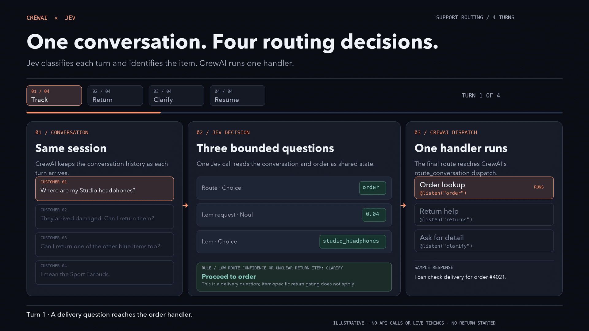

# CrewAI Conversational Flows × Jev

A small, runnable example that uses TypeSafe's Jev model to route support turns and check whether an item-specific return request is ready to proceed inside a real CrewAI conversational flow.



**The GIF shows the current four-turn support flow.** It illustrates the three Jev questions, the application rule, and CrewAI handler dispatch. Its answers and replies are authored, not live measurements. The Python program makes actual Jev requests and prints the returned answers, measured request latency and estimated cost.

Open the [interactive HTML diagram](docs/flow-diagram.html) locally to step through the same four turns. It makes no API calls.

## Run with Jev

Requires Python 3.11–3.13, [uv](https://docs.astral.sh/uv/getting-started/installation/), and a TypeSafe API key.

```sh
cd modules/04-agentic-routing-jev/example
uv sync --locked
uv run --env-file ../../../.env python flow.py
```

This starts an interactive terminal conversation with **real Jev calls**. Type a support message at `You:` and continue with follow-ups in the same session; type `exit` or `quit` to finish.
Run these commands from the lab root. The root `.env` must contain `TYPESAFE_API_KEY`.
`uv run` selects this example's environment; activating it is unnecessary.

To run the authored four-turn example instead:

```sh
uv run --env-file ../../../.env python flow.py --demo
```

Each turn calls Jev once, prints the routing decision, and runs the selected sample CrewAI handler. The live model may safely choose `clarify` at low confidence even when the authored example expects another route; the demo reports that difference and continues. `--chat` remains an alias for interactive mode. The handlers return fixed example replies and do not look up a real order or start a return. This repo uses CrewAI's [`Flow.chat()`](https://docs.crewai.com/en/guides/flows/conversational-flows) terminal loop; it is not configured as a `crewai run` project.

If you activated the example before its directory changed from `05-agentic-routing-jev`
to `04-agentic-routing-jev`, run `deactivate` in that terminal first. A stale
activation points `python` to the old directory. Then use the `uv run` command
above; if you need an activated shell, run `source .venv/bin/activate` again
from this `example/` directory.

The `--demo` run sends four support messages in one session. Order #4021 contains three blue products:

1. “Where are my Studio headphones?”
2. “They arrived damaged. Can I return them?”
3. “Can I return one of the other blue items too?”
4. “I mean the Sport Earbuds.”

Each turn makes one request to `https://api.typesafe.ai/v1/systemone` using `jev-latest`. The request sends conversation history, the sample order, a Choice question for `order`/`returns`/`clarify`, a yes/no question for whether the customer requests help with a particular item, and a Choice question naming that item or `unresolved`. A route Choice confidence below 0.50 goes to `clarify`. An item-specific return request also goes to `clarify` when the item is unresolved or the item Choice confidence is below 0.60. General return-policy questions can reach `returns` without identifying an item.

Handlers return sample replies; they never modify orders or initiate refunds. Replace them with your own read-only tools or agent calls as needed. No OpenAI key is needed for this example's routing or replies.

## Check it without an API key

```sh
uv run python smoke_check.py
```

This runs the real CrewAI lifecycle with mocked HTTP responses. It checks that the ambiguous third turn reaches `clarify` even when Jev chooses `returns`, and that the resolved fourth turn reaches `returns`. No model API requests are made. Installing dependencies still requires network access on the first run.

## Evaluate the router

The [support evaluation](docs/support-evaluation.md) compares Jev with GPT-6 Luna and Astra on 31 authored return-readiness conversations and explains [where Jev fits in a CrewAI flow](docs/support-evaluation.md#where-jev-fits-in-a-crewai-flow). All three reached 31/31 final routes in one live pass. Jev's raw item Choice was 30/31; its low-confidence abstention corrected that final route. These cases were used to tune the demo and do not establish production accuracy.

```sh
# Validate the dataset and scoring without API calls.
python3 eval_router.py --check
# Compare return readiness: requires TYPESAFE_API_KEY and OPENAI_API_KEY.
uv run --env-file .env --no-project python3 eval_router.py
# Jev only:
uv run --env-file .env --no-project python3 eval_router.py --models jev
```

The evaluator defaults to `return_readiness` and saves raw responses, usage, timings and scores under git-ignored `eval_results/`. These authored cases are a diagnostic; they cannot establish production accuracy.

## How routing works

```text
handle_turn(message)
  → route_turn(): history + order + three typed questions → Jev
  → validate two Choice answers and one yes/no answer
  → low-confidence route ? clarify : choice
  → returns + item-specific request + (unresolved or low-confidence item) ? clarify : choice
  → @listen(selected_route)
  → append assistant reply and retain session state
```

Returning a non-empty route from `route_turn()` bypasses CrewAI's built-in LLM classifier while still using its `route_conversation` dispatch and session lifecycle. The `@listen` handler appends the assistant message; all turns share one session ID. This example never selects CrewAI's built-in `converse` route, so its generation handler is outside the evaluation. The no-key smoke check and live demo verify dispatch to the three custom handlers; the 31-case model comparison calls providers directly.

A Jev Choice answer contains:

```json
{
  "type": "choice",
  "choice": "returns",
  "probabilities": {"order": 0.01, "returns": 0.97, "clarify": 0.02},
  "confidence": 0.92
}
```

These JSON values are illustrative. Confidence is a separate statistic derived by TypeSafe from the probability distribution, not the winning probability or a guarantee of correctness. The demo uses a 0.50 confidence floor for the **route Choice**, following [TypeSafe's intent-routing example](https://docs.typesafe.ai/patterns/intent-routing), and a 0.60 floor for the **item Choice** tuned on synthetic cases. Neither threshold has been validated on real support traffic.

The original Choice answer stays in `decision["answer"]`, even when the item check selects a different handler. Missing or invalid answer fields fail before a handler executes.

## Measurement and configuration

- `TYPESAFE_API_KEY`: required for real requests; `.env` is git-ignored.
- `JEV_MODEL`: defaults to `jev-latest`.
- `JEV_INPUT_USD_PER_MILLION`: defaults to `0.042`; update it to your applicable pricing.
- `latency_ms`: wall-clock time for the HTTP request and JSON response.
- `estimated_cost_usd`: reported input tokens multiplied by the configured input rate. Assumes zero output-token cost; excludes tools, infrastructure and handler work.

The flow lifecycle is checked with mocked responses, and the [support evaluation](docs/support-evaluation.md) contains live readiness measurements. The GIF is illustrative and contains no model comparison. `flow.py` calls Jev only. The scripted demo enables CrewAI tracing; interactive chat leaves tracing and CrewAI telemetry disabled by default unless you explicitly enable them in your environment.

## Files

- `flow.py`: actual CrewAI flow and TypeSafe HTTP call.
- `scenario.json`: sample conversation and order state.
- `smoke_check.py`: no-key lifecycle and item-readiness check.
- `eval_router.py` and `eval_cases.json`: support readiness comparison and authored cases.
- `docs/support-evaluation.md`: payload audit and live readiness results.
- `docs/flow-diagram.html`: interactive four-turn walkthrough; open locally in a browser.
- `docs/demo.gif`: 19-second, 1080p four-turn walkthrough.

## References

- [CrewAI conversational flows](https://docs.crewai.com/en/guides/flows/conversational-flows)
- [TypeSafe API](https://docs.typesafe.ai/api)
- [TypeSafe confidence](https://docs.typesafe.ai/confidence)
